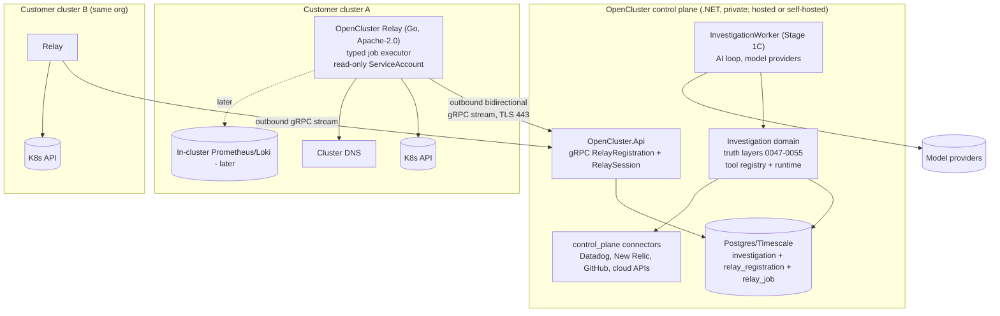

# Customer Execution Plane (OpenCluster Relay)

Status: ACCEPTED (founder decision 2026-07-20, with modifications to revision 2) —
revision 4 applies the round-3 review closures (nine blockers, all warnings); closure
verification by the seven reviewers is the remaining gate before implementation code.
Date: 2026-07-20 (revision 4 — round-3 closures; revision 3 recorded the founder
modifications: Go Relay, gRPC v1, Protobuf source of truth, Relay-only Kubernetes with
C# retirement, separate clean-history repository)
Decision record: `docs/architecture/decisions/ADR-001-customer-execution-plane.md`
Implementation plan: `plans/stage-1b-customer-execution-architecture.md` in the frozen .NET reference repository (OCluster/Zyrenn.ConsumerService)
Authority: the decision records under `docs/architecture/decisions/`. The master plan this
document once supplemented was deleted on 2026-07-31: the product direction moved, and a
standing definition nobody maintains is worse than none. The three deviations it recorded
(section 3.5) stand as accepted and are described here rather than by reference.

---

## 1. Purpose

Decide where investigation execution runs for customer environments: fully in-cluster
(HolmesGPT model), fully central (the kubeconfig readers), or split. Define the
customer-side component, its protocol, its security model, and its relationship to
connectors, topology, and the frontend.

The product thesis constrains the answer: OpenCluster's differentiator is the durable,
auditable, replayable investigation truth layer. Any architecture that fragments that layer
across customer clusters destroys the moat.

## 2. Reference model: HolmesGPT

Analyzed at commit `3bccb1d4ffb9aff21561f79bbfe43c8c8602f6a3` (robusta-dev/holmesgpt,
branch master, Apache-2.0, 2026-07-20). Claims below are traced to source, not
documentation. No HolmesGPT code is copied or reused anywhere in OpenCluster; this is an
architecture study of a permissively licensed project and triggers no attribution
obligation.

### 2.1 How HolmesGPT works

One Python process contains everything: the LLM call (LiteLLM, in-process), the agent loop
(`while i < max_steps`, default 100), and tool execution (ThreadPoolExecutor, 16 workers).
It deploys as a CLI (user kubeconfig), an in-cluster Helm Deployment (ServiceAccount with a
read-only get/list/watch ClusterRole), an HTTP server, or a Robusta-platform subchart.

| Aspect | HolmesGPT at the analyzed commit |
| --- | --- |
| LLM location | In-process wherever Holmes runs — in the customer cluster for in-cluster mode; the optional Robusta AI proxy path keeps provider credentials SaaS-side. |
| Model credentials | Env vars or config file in the same pod, except on the proxy path. |
| Tools | Half YAML shell-command templates (kubectl through a bash executor with an AST allowlist), half typed Python API toolsets (Prometheus, Datadog, New Relic). |
| Generic shell | `bash` toolset enabled by default; read-only prefix allowlist; unknown prefixes require human approval (signed JWT); `sudo`/`su` hard-blocked. |
| State | In-memory message list only. No hypothesis, evidence, contradiction, or conclusion store. Restart loses the investigation except on the Robusta SaaS path, which snapshots message history to Supabase. |
| Provenance | Flat list of tool-call results keyed by id; no machine-enforced link from conclusion to evidence; final answer is free-text markdown. |
| Incomplete permissions | RBAC denial text returns to the LLM as ordinary tool output; no coverage-gap concept. |
| Multi-cluster | One install sees one cluster. Cross-cluster only through central observability backends or the Robusta SaaS MCP relay. |
| Diagnostics | dig/tcpdump via bash; `connectivity_check.tcp_check` opens raw sockets to any host/port, default-enabled; `internet.fetch_webpage` fetches any URL without private-IP/metadata blocking. |
| Ephemeral pods | Opt-in toolsets (`kubectl_run`, inspektor-gadget) create temporary pods; disabled by default. |
| Footprint | 2 GiB memory request; large image bundling kubectl, helm, dig, tcpdump, cloud SDKs. |
| Tenancy | Single-tenant per install; SaaS side scopes by account id. |

### 2.2 What OpenCluster must do differently

Ordered by how well each difference survives adversarial scrutiny:

1. Closed typed execution surface. HolmesGPT ships a default-enabled bash toolset behind a
   prefix allowlist; OpenCluster's customer-side component has no shell, no command
   strings, no dynamic code anywhere — a compiled, closed, typed capability registry with
   CI-enforced mechanical gates (section 5.3). This is the largest verifiable
   attack-surface difference.
2. Durable structured truth. HolmesGPT's state is a transcript; OpenCluster persists
   observations, validated evidence, hypotheses, contradictions, conclusions, and coverage
   gaps append-only with fencing and budgets, and can replay investigations from closed
   case packs. HolmesGPT cannot represent a coverage gap or a certified negative at all.
3. Multi-cluster by construction. One investigation fans typed jobs to N registered
   Relays; HolmesGPT is structurally single-cluster per install.
4. Reasoning locality. OpenCluster never runs model code in customer environments. This is
   a supporting point, not the headline: HolmesGPT's Robusta-proxy path also keeps
   provider credentials out of the cluster. What the proxy path does not change is items
   1-3 — the in-cluster process still executes shell templates and holds transcript-only
   state.

| Dimension | HolmesGPT | OpenCluster |
| --- | --- | --- |
| Tool surface | Shell templates + allowlist + approval | Closed typed capability registry; no command strings |
| Investigation state | In-memory transcript | Durable append-only truth layers |
| Negative claims | Unstated or asserted | Refused without a completeness certificate (store invariant) |
| Coverage gaps | Not representable | First-class, actionable |
| Multi-cluster | Structural gap | N Relays per org feed one run |
| Replay | Not possible | Closed-world case packs |
| SSRF posture | Raw fetch/socket, default-on, unguarded | Destination policy enforced in two independently-authored layers |

HolmesGPT's genuinely good ideas — read-only ClusterRole discipline, hard structural
blocks over configurable ones, human approval for escalation — are adopted in stricter
form.

## 3. Deployment model decision

### 3.1 Options evaluated

| Option | Shape | Verdict |
| --- | --- | --- |
| A. Full in-cluster investigator | AI loop + tools + state per customer cluster | REJECTED. Fragments the truth layer, recreates the single-cluster gap, per-cluster upgrade of reasoning code, breaks replay/evaluation. The honest core objection is state and replay, not LLM locality (see 2.2). |
| B. Central investigator, direct connectors | Control plane dials customer K8s/Prometheus with customer credentials | REJECTED. Requires internet-reachable API servers (many are private), concentrates customer cluster credentials on vendor disk, cannot reach in-cluster Prometheus/Loki, and central DNS checks are meaningless. Founder modification (2026-07-20): no longer retained as a permanent mode for self-hosted either — the central C# Kubernetes path survives only as temporary migration and differential-test infrastructure (the parity oracle) and is removed after cutover (section 12). |
| C0. Minimal fixed-identity diagnostics probe | Master plan 7.1 exactly as written | CLOSED — the founder chose the full-protocol walking skeleton (decision 1b). |
| C. Central investigator + lightweight Relay | Reasoning and state central; small in-cluster component executes typed bounded operations | CHOSEN and ACCEPTED as the target structural model. |
| D. Central investigator + rich in-cluster Agent | As C with many toolsets behind a typed protocol | Adopted only as C's growth path: the capability roster grows, but the component never gains investigation awareness, local reasoning, or generic command execution. |
| E. Fully self-hosted platform | Everything in the customer environment | Not a competing architecture: a deployment mode of the same architecture. Founder modification: self-hosted also uses the Relay for Kubernetes execution — beside the control plane or inside each managed cluster (section 7). |
| F. Hybrid modes | Hosted+Relay, self-hosted full, evidence-only, local-model | One architecture with N deployment modes, differing only in egress policy (master plan 15.1 classes) — no longer in execution locality for Kubernetes, which is Relay-only after migration. |

### 3.2 Chosen target architecture

One private .NET control plane owns reasoning, scheduling, and truth. One customer-side
component — the OpenCluster Relay, implemented in Go, open-source by design (Apache-2.0),
in its own clean-history repository — executes typed, bounded, read-only jobs inside the
customer environment and returns bounded structured results over one outbound
bidirectional gRPC stream on 443.

Execution locality is a property of each connection, named with a closed vocabulary in
all newly designed public contracts:

- `control_plane` — native OpenCluster data (own metric store) and public SaaS APIs
  (Datadog, New Relic, GitHub, cloud providers), executed centrally.
- `relay` — customer-private or cluster-local sources (Kubernetes, container logs,
  cluster DNS/TCP/TLS diagnostics, in-cluster Prometheus/Loki), executed by a registered
  Relay.

The ambiguous term `direct` is banned from newly designed public contracts; it may
persist only inside migration-era internal code that section 12 removes. Tools, evidence
validation, and certificates are identical in both localities; locality is visible as
provenance and trust class (section 4.2).



Properties: no inbound connectivity to customer environments; cluster credentials never
leave the customer environment; model credentials never enter it; one investigation spans
clusters by dispatching to multiple Relays; raw reasoning never crosses the customer
boundary in either direction; exactly one production implementation of customer-private
Kubernetes execution in the end state (Go, in the Relay).

### 3.3 Build scope — decided

The founder chose the full-protocol walking skeleton (decision 1b): registration,
bootstrap, the fenced durable job channel, and one real capability now, with a
deliberately minimal operator surface (single registration, manifest-delivered bootstrap,
no rotation UX). The minimal-probe alternative is closed.

### 3.4 Naming decision

The component is the **OpenCluster Relay** (always the qualified two-word form in anything
public); the architectural layer is the customer execution plane.

- "Agent" is rejected: in an AI product it implies the AI runs in-cluster — the opposite
  of the trust story — and collides with the existing otel-collector compose service named
  `agent`. Customer-facing language should reserve "agent" for nothing: the two-component
  story is "the collector pushes telemetry; the Relay executes reads".
- "Probe" undersells a component that will carry Kubernetes reads and logs.
- "Relay" is the master plan's existing term and honest: it relays typed jobs and bounded
  results and holds no intelligence.
- External collisions, found in review: Sentry Relay (getsentry/relay — a customer-side
  component between customer infrastructure and a central SaaS; the closest in-domain
  collision, and getsentry owns the `relay` container-image name) and GraphQL Relay
  (Meta). Consequences: never ship a bare `relay` package/image/repo name; run name
  clearance (registries, GitHub, trademark screen) before any public tag; if clearance
  fails, pick a more distinctive component name — the architecture is name-independent.
- Until clearance completes, the Relay repository uses a provisional module and image
  identity (private org path); changing it is a mechanical rename while private.
- Separately, "OpenCluster" itself collides with CNCF's Open Cluster Management project in
  the same multi-cluster vocabulary space. That is a program-level brand question routed
  to the founder with the OSS Phase 0 rebrand work, not decided here.

Follow-up chore (stands with the ratified name): rename the unrelated
`NotificationRelayWorker` (outbox fallback poller) to clear the internal vocabulary.

### 3.5 Master-plan deviations — accepted

1. Relay scope widened. Master plan 7.1 scopes the Relay to diagnostics only; it is now
   the general customer execution plane: Kubernetes reads, container logs, diagnostics,
   revision capture, later in-cluster Prometheus — one component, one identity, one
   upgrade path.
2. HTTP diagnostics deferred. DNS, TCP, and TLS-handshake checks are sequenced;
   HTTP-path checks (org-configured safe paths per 7.1) come later. Deferral, not
   removal.
3. Revision-ledger capture mode narrowed for v1: periodic scheduled list-and-diff jobs
   (central diffing) rather than a continuous WATCH. Sub-interval mutations and objects
   garbage-collected between captures are declared configuration-history gaps. A
   continuous watch returns as an additive streaming extension of the same gRPC session —
   no longer a second protocol (a benefit of the founder's gRPC-first decision).

### 3.6 Founder modifications (2026-07-20)

The founder accepted the revision-2 target structural model and modified four decisions;
this revision integrates them throughout:

1. Language: the Relay is Go (was: .NET 9). The control plane remains private .NET. The
   honest matrix record and the repricing of the two .NET-favoring criteria are in the
   plan, section 2.
2. Transport: outbound bidirectional gRPC stream over TLS on 443 from protocol v1 (was:
   HTTPS long-poll with gRPC later). The compatibility risks long-poll dodged are named
   in the risk register (5.4) with per-risk mitigations and tests, and gated by a
   feasibility test against the real edge stack.
3. Contract authority: Protobuf is the single language-neutral source of truth (was:
   OpenAPI). Go and C# types are generated or verified from the same contracts; no
   manually duplicated transport DTOs.
4. Kubernetes execution: Relay-only after migration, for hosted AND self-hosted (was:
   permanent `direct` mode for self-hosted/dev). The C# Kubernetes implementation is a
   temporary migration oracle and is removed behind explicit gates (section 12).
5. Repository: the Relay is a separate sibling repository with clean history (was:
   same-repo now, fresh-history extraction later).

## 4. Responsibility boundaries

| Concern | Runs where |
| --- | --- |
| OpenCluster.Api | Control plane. Hosts the gRPC RelayRegistration and RelaySession services and the Relay admin/read APIs. |
| InvestigationWorker (Stage 1C) | Control plane. Dedicated host for the AI loop; least-privilege DB role (existing obligation). Never executes customer Kubernetes reads. |
| Investigation domain, truth layers, budgets, certificates | Control plane, unchanged. |
| Tool registry and runtime | Control plane. The runtime resolves execution locality per connection and dispatches relay jobs where locality = `relay`. |
| Kubernetes execution | Relay-only after migration (Go, client-go, in-cluster ServiceAccount; explicit-kubeconfig client mode for the beside-control-plane self-hosted deployment and the parity harness). During migration only: the C# readers serve as the differential-parity oracle, constructed by tests — never by a production composition root (their current state). |
| Prometheus execution | In-cluster Prometheus: Relay capability (later phase). SaaS/reachable Prometheus and vendor APIs: `control_plane` connectors. |
| Log execution | Relay capability (`kubernetes.container.logs.v1`, after runtime/discovery parity). Bounding and heuristic secret-masking applied at source before egress. |
| DNS, TCP, TLS diagnostics | Relay only. Master plan 7.1/15.1 destination policy in full; HTTP-path checks deferred (3.5). |
| Model providers and credentials | Control plane only. Never in the Relay. |
| Evidence extraction | Mechanical bounding/truncation/masking at source (Relay); semantic candidate production and all validation central (single 0050 path). The Relay returns bounded typed source results; the .NET tool bodies keep all candidate/gap/certificate logic. |
| Evidence validation, absence certificates | Control plane only; relay-attested completeness is a distinct trust class (4.2). |
| Investigation state, replay | Control plane only. Replay reads persisted observations; never re-dispatches to Relays. |
| Topology | Observation snapshots now; bounded store later (section 8). |
| Configuration history (S1B-6) | Periodic list-and-diff Relay jobs; diffing and ledger storage central. Continuous watch deferred (3.5). |
| Credential storage | Cluster credentials: the Relay's own ServiceAccount (or its explicit kubeconfig in beside-control-plane mode), always customer-side. Relay identity credential: a pre-created named Secret in the Relay's namespace, self-managed (5.1). SaaS connector credentials: control-plane secret store. Kubeconfig directory custody in the control plane: migration-era oracle infrastructure only, removed in section 12. |
| Operator configuration | Control plane: connection registry, relay registry, capability toggles. Relay-side: identity, endpoint, and the customer-authored local policy (5.3) — which the control plane can read as attestation but never write. |
| Frontend | Control plane. Integrations surface for Relay install/health (section 10). |

### 4.1 Explicit answers

- The AI loop runs centrally. In-cluster reasoning is rejected (option A).
- Raw source queries for customer-private/cluster-local sources run in the Relay;
  `control_plane` locality covers native data and public SaaS APIs only.
- Evidence extraction happens in both places with distinct roles: mechanical bounding and
  masking at source, semantic extraction and validation central.
- Raw logs do not leave the customer environment unbounded. Server-declared bounds and
  source-side masking apply before egress. Masking is heuristic defense-in-depth, not a
  guarantee. The durable controls are the 15.1 egress classes, customer-defined patterns,
  and downstream taint. Masking and PII rules are part of the customer-authored local
  policy and cannot be weakened by the control plane.
- Only bounded structured results leave. Size caps are enforced twice: Relay-side before
  send (typed truncation, strictly below the transport limit), control-plane side on
  receipt against decompressed size.
- The Relay does not understand investigations. It executes jobs: capability id + version,
  typed Protobuf arguments, bounds, deadline budget, idempotency key. It never sees
  hypotheses, prompts, model output, or incident semantics beyond an opaque correlation id
  for audit — and "opaque" is a tested property: a random token with no embedded
  incident/model/tenant semantics, so investigation context cannot leak into the
  customer's local audit log. The Relay verifies every inbound job as a first-class
  check: org id and registration id match its bootstrap-bound identity, the capability
  is compiled in at the stated version, and the job is within advertised concurrency —
  any mismatch is refused and audited as a control-plane-compromise indicator. It contains no model, no AI reasoning, no incident state, no shell, no
  scripts, no dynamic plugins, no arbitrary command execution, and no generic remote
  procedure mechanism.
- One component covers Kubernetes, logs, Prometheus, and diagnostics. Compiled capability
  modules in one Go binary, one identity, one stream, one upgrade path.
- RBAC, stated honestly: the manifest grants `get` and `list` on the allowlisted resource
  set, plus `watch` only if/when a watch-bearing capability ships, plus the `pods/log`
  subresource for the logs capability (RBAC cannot scope which pods' logs — source-side
  masking and server-side bounds are the only content controls there, and the manifest
  says so), plus a narrow own-identity exception: get/update on one pre-created named
  Secret in the Relay's own namespace for credential custody (5.1). No other secrets
  access, no exec, no create/update/delete of cluster resources. Two manifest variants
  ship: cluster-scope ClusterRole, and a namespaced variant (Role + RoleBinding per
  allowed namespace). The manifest grows as capabilities ship; each capability slice
  carries a threat-model delta.
- Datadog, New Relic, GitHub, AWS: `control_plane` connectors. On-prem-only sources: out
  of scope until the connector framework stage; the typed capability model is the
  designated path.
- One investigation spans clusters and providers because the scheduler dispatches
  per-job; all results feed one run's evidence with per-job provenance. Cross-cluster
  negative claims have an explicit aggregation rule (4.2).
- Versioning: advertised capability versions at hello/heartbeat; dispatch honors them;
  the Relay additionally re-validates every assigned job against its compiled-in registry
  at execution start and returns a typed unsupported-version result — advertisement is an
  optimization, not the safety boundary. Support window stated in time, not only
  versions: a Relay release is supported for at least six months (with the N-2 minor rule
  as a floor); a Kubernetes-server compatibility matrix is published per release.
  Capability absence surfaces as a coverage gap, never a silent skip.
- Replay never re-queries production: results persist centrally as
  observations/snapshots at execution time; case packs are closed-world; the Relay is
  live-path only.

### 4.2 Trust model for relay-executed results

In `control_plane` locality the control plane observes completeness facts itself. In
`relay` locality those facts are attested by a process running in the customer's trust
domain. The control plane cannot re-derive them without redoing the read. Consequences,
made explicit:

- Distinct trust class. Evidence validation records whether completeness facts are
  control-plane-verified or relay-attested. The class travels with the evidence and
  appears in provenance.
- Structured completeness proof, not a boolean. Relay results carry the basis fields the
  control plane can range- and shape-check: returned resourceVersion, item counts,
  explicit continuation-token state per page, RBAC outcome per read, truncation flags.
  Malformed or internally inconsistent bases are rejected.
- Confidence policy. A certified negative resting solely on relay-attested completeness is
  capped below High unless corroborated by an independent evidence family (the existing
  4.3 independent-family rule does this work).
- Cross-cluster negatives. A certified "absent everywhere in scope" requires every
  in-scope registered Relay to have returned a complete result; any in-scope Relay
  degraded, absent, denied, or truncated forces a coverage gap and withholds the
  cross-cluster negative (S1B-4's per-pair discipline lifted to fan-out).
- Honest residual. A compromised Relay can fabricate well-typed results about its own
  cluster — the customer's own trust domain. This is within-tenant integrity, never
  cross-tenant, and it is bounded (attributed provenance, trust class, confidence caps,
  taint, size caps), not prevented. Schema validation prevents malformed corruption of
  the truth layer; it cannot prevent content-level falsification by the leased identity.
- Cluster identity pinning. The Relay advertises a stable cluster fingerprint (the
  `kube-system` namespace UID) at registration; the control plane pins the connection to
  it and refuses or flags a fingerprint change. Honest scope: this detects re-pointed and
  freshly rebuilt clusters, not a full etcd-preserving restore that keeps the UID.

## 5. Protocol design (v1)

Protobuf is the single language-neutral protocol source of truth, owned by the Relay
repository under `proto/opencluster/relay/v1/` and managed with Buf (format, lint,
breaking-change detection, deterministic generation, descriptor sets). Go code is
generated into the Relay repository; C# types are generated at build from a synchronized
proto copy with a pinned-manifest drift gate. There are no manually duplicated transport
DTOs and no competing OpenAPI authority for this protocol. Message and service names
below are the proposed shape, subject to the R1 slice-plan review:

```proto
service RelayRegistration {
  rpc Register(RegisterRequest) returns (RegisterResponse);
}

service RelaySession {
  rpc Connect(stream RelayToControl) returns (stream ControlToRelay);
}
```

Both streams carry closed envelope variants using `oneof`. Relay-to-control: hello,
heartbeat, job acknowledgement, job started, job result, cancellation acknowledgement,
drain state, protocol error. Control-to-relay: session accepted, job assignment,
cancellation, result acknowledgement, credential rotation instruction, drain instruction,
server capability requirements, graceful reconnect instruction.

Banned in the protocol, enforced by CI schema-shape gates: `google.protobuf.Any`,
`Struct`, `Value`, map-based argument payloads, raw JSON capability payloads, command
strings, scripts, executable paths, dynamic method names. Every capability has a
versioned typed argument message and result message. The transport envelope evolves
additively (proto3 + `buf breaking` in CI); capability messages are strict and frozen —
any change mints a new versioned message type, and the Relay mechanically refuses
arguments carrying unknown fields (protoreflect unknown-field check) or capability
versions outside its compiled registry.

### 5.1 Identity and registration

| Step | Behavior |
| --- | --- |
| Operator creates a Relay registration | Control plane, org-scoped, bound to a named cluster/environment. Mints a one-time bootstrap token: short TTL (hours), single-use, org+registration-bound, displayed once (api-key precedent). Delivery avoids argv exposure (stdin/file/env, never a command-line argument that lands in shell history or `ps`); never committed GitOps values; docs recommend sealed-secret/secret-store delivery for GitOps shops. |
| Bootstrap exchange | `RelayRegistration.Register` outbound over TLS with the bootstrap token in call metadata; returns the relay id, the org id (bound locally so the Relay can verify job envelopes, 4.1), and the durable credential (random 256-bit). Token consumed atomically; second use fails, is audited, AND a legitimate install failing on an already-consumed token is surfaced as a possible-interception alert, not a support noise line. Register is unauthenticated-reachable and gets its own flood protection: strict global and per-IP rate caps, constant-work rejection of invalid tokens, and no expensive computation before token validity is established. |
| Credential custody | The Relay writes its durable credential to one named Secret in its own namespace and reads it on restart. This is the single RBAC exception (4.1): the Secret is pre-created (empty) by the install manifest, and a namespaced Role grants only get/update scoped by resourceNames to exactly that one Secret — no create verb, because Kubernetes RBAC resourceNames cannot constrain create. Helm ownership hazard, closed by design: the Secret must NOT be a normally-templated release resource or `helm upgrade` reconciles it back to empty and wipes the identity on every upgrade — it ships as a create-once `pre-install` hook with `helm.sh/resource-policy: keep` (or documented out-of-band creation), never re-applied on upgrade. Writes use optimistic concurrency (update with resourceVersion, retry-on-conflict) so a stale writer fails loudly instead of clobbering a successor. Client error taxonomy is typed: not-found → re-bootstrap-needed degraded state (no create verb exists to self-heal); forbidden → RBAC misconfiguration surfaced distinctly; conflict → CAS retry; reads are direct typed GETs (no informers — LIST/WATCH are not granted). The credential never transits Helm values or GitOps repos. At-rest exposure: any principal with secrets-read in that namespace can read it; etcd encryption-at-rest recommended; documented. Lost-Secret recovery = operator mints a new bootstrap token (old credential revoked). Beside-control-plane mode (self-hosted) uses filesystem custody with the same rotation semantics but honestly weaker protections: POSIX 0600 under a dedicated UID, encrypted-at-rest recommended, and no access audit trail comparable to the Kubernetes audit log — stated, not implied equal. |
| Session authentication | Every `Connect` carries the relay credential in call metadata over TLS; the server validates against a stored digest. Verification is deliberately CHEAP: the credential is server-generated 256-bit random, so a constant-time comparison against a SHA-256/HMAC digest is cryptographically sufficient — the memory-hard Argon2id used for the existing API-key path is explicitly NOT used on Connect, because an expensive KDF per connection would turn reconnect storms into a memory-bound amplification DoS (5.4 row 8 depends on Connect staying cheap). |
| Replicas | v1 posture: exactly one replica, ENFORCED by the workload strategy (`strategy: Recreate` or a single-replica StatefulSet), not assumed — default RollingUpdate briefly runs two pods on every upgrade, creating a Secret-writer race and a bootstrap-token double-consume race. If two pods do start together on first install, the token loser must re-read the now-populated Secret and proceed with that credential, never crashloop. Missed heartbeats surface as degraded capability status in coverage gaps and the Integrations page. Active-active replicas is a recorded R2+ decision. |
| Rotation | Server-pushed credential rotation instruction on the stream: control plane issues a successor while the predecessor stays valid for a bounded window; the Relay persists the successor to its Secret FIRST and confirms only after the write commits (a restart mid-rotation then finds the successor; the server holds the predecessor valid until confirmation); predecessor revoked after confirm. Rotation instructions are rate-bounded on the Relay side like every server push (5.2 backpressure) — rotation spam would otherwise drive Kubernetes API writes, a path the read-oriented local caps do not cover. Operator-triggered and periodic. No rotation UX until a then-current need exists. |
| Revocation | Immediate central revocation; session establishment and result acceptance fail closed. |
| Endpoint pinning | The Relay pins the control-plane endpoint. SPKI (leaf-key) pinning preferred over an issuing-CA pin; backup pins and an overlap window keep control-plane certificate rotation from failing the fleet closed. Pin lifecycle specified, not assumed: at least one backup pin at all times; pin-set refresh is delivered over the already-pinned, authenticated stream (trust continuity) and persisted locally, so consuming the backup runway mints new runway; a staleness bound flags a Relay whose pin set has not refreshed; unplanned key loss recovery = re-bootstrap with a fresh token (which re-delivers the pin set) — documented, since no central override exists by design. Customer-visible in local config. Without pinning, enterprise TLS-inspection egress proxies — a rogue-CA MITM by design — could capture the bearer credential and impersonate the control plane. Pin-disable for TLS-inspection shops is a constrained escape hatch, not a toggle: dangerously named (`insecureDisableEndpointPinning`), never default, never inferred, emits a startup warning and continuous local-audit marker, self-reports in `hello` so Integrations shows "endpoint pinning DISABLED", and those customers are named the priority cohort for the mTLS slice (a non-exportable client certificate is the control an inspecting proxy cannot forge). The docs state plainly that a bearer credential is exposed to any TLS-terminating middlebox the customer inserts ahead of pin verification. |
| Credential non-disclosure (both sides) | The Relay never logs credentials; the CONTROL PLANE symmetrically never logs the credential metadata key — gRPC metadata is HTTP/2 headers, and ASP.NET HttpLogging / server interceptors / OTel gRPC instrumentation can capture headers, so the credential key goes on an explicit redaction denylist with a test asserting it never appears in control-plane logs or traces, and edge/access logs (Caddy/Kestrel) are configured to never record it. |
| mTLS | Deferred to an enterprise slice; recorded as protocol v2. The stolen-credential row in the threat model (section 6) records why mTLS is more than cosmetic. |

### 5.2 gRPC session and job lifecycle

| Aspect | v1 decision |
| --- | --- |
| Transport | One outbound TLS connection from the Relay to one configured OpenCluster endpoint on 443, carrying gRPC (HTTP/2). Standard proxy support: HTTPS_PROXY/NO_PROXY with HTTP CONNECT (TLS end-to-end through the tunnel preserves HTTP/2); authenticated proxies documented and wired. |
| Control-plane host integration | The gRPC services get a DEDICATED Kestrel endpoint, not the existing REST port: either direct Kestrel TLS with `Http1AndHttp2` (ALPN selects h2) or an Http2-only endpoint behind an edge terminator with an h2c upstream. Cleartext single-port multiplexing of HTTP/1.1 REST and h2c gRPC is rejected — h2c has no ALPN and relies on fragile preface sniffing. The Relay endpoints run OUTSIDE the REST middleware stack: exempt from the Clerk JWT pipeline (relay-credential metadata is its own scheme, the AllowAnonymous+Svix precedent), the JSON exception envelope (it would corrupt gRPC framing/trailers), HTTPS redirect/HSTS (a 307 on an h2c hop breaks the stream), and the fixed-window IP rate limiter (replaced by Relay-specific connect limits, since NAT'd fleets share IPs). These in-process concerns are feasibility-gate items alongside the wire path (5.4). |
| Session establishment | `Connect` with credential metadata → Relay sends `hello` (protocol version, relay version, capability roster with schema versions, cluster fingerprint, local-policy hash, max concurrent jobs from local policy, endpoint-pinning state, and an in-flight job roster: job id + lease epoch + elapsed monotonic time for every job still executing from a previous session) → server replies `session_accepted` (session id, negotiated protocol version, heartbeat interval, message-size limits, capability requirements) or a typed refusal. The roster lets the server reconcile deterministically: renew leases for still-running jobs, expire the rest immediately — no full-lease-expiry latency after every blip. The roster is ATTESTED input with no authority of its own: it can only renew leases for jobs already assigned to that registration under a valid epoch — the fence and terminal-status guard decide everything else, so a forged roster (stolen credential) cannot resurrect or cross-claim jobs. Per-message validation on both ends before any state effect; malformed input → typed protocol error + audit, never a crash. |
| Session registry | In-memory per API replica: active session per registration. It is a delivery index only — it never authorizes results and never becomes the job source of truth. Durable truth is `relay_registration` + `relay_job` in PostgreSQL. |
| Duplicate sessions | Newest credential-valid session supersedes; the old stream receives a graceful reconnect instruction and is closed; supersession is audited. Correctness never depends on this: job-level fencing decides result acceptance regardless of which stream delivered it. Rapid supersession churn per registration (rate + distinct peer addresses) is detected and surfaced to the operator as a first-class credential-theft indicator — a stolen credential superseding the real Relay produces exactly this signature, and the victim's own view is only "connected then immediately superseded", which must escalate rather than silently loop. A minimum-session-lifetime/backoff applies even after a successful-then-dropped connect so a flap loop cannot re-trigger catch-up dispatch churn. |
| Job store | `relay_job` table extending the repo's outbox/lease discipline (0042/0048 heritage), with one honest caveat: `lease_epoch` exists in NEITHER proven implementation — the epoch is new and is the crux of push-model correctness, so it gets first-class adversarial interleaving tests (5.4 row 4/9 gates), not "proven" framing. Columns: org, relay registration, capability id + version, typed args (serialized Protobuf), bounds, deadline budget, idempotency key, lease columns, `lease_epoch`, attempts, status. Terminal rows join the retention worker's explicit table list (terminal-only, pending/leased never touched — the notification_outbox precedent); `relay_registration` is config data, excluded by design. Index/constraint names and enum COMMENTs follow house convention and are enumerated in the R1 slice plan; 23505 mapping is by constraint name. New migrations are 0056+, append-only. |
| Clock contract | All lease/expiry/fence comparisons use the control-plane clock exclusively (the 2026-07-19 outbox lesson). WIDENED per review: the contract covers not only lease values but every ELIGIBILITY/RETRY timestamp — no `relay_job` column consumed by any dispatch, eligibility, or retry predicate may rely on a database `DEFAULT now()` while being compared to a caller-supplied clock (the exact `created_at` class of the 2026-07-19 defect); all such columns are authored with the control-plane clock, and a DB DEFAULT may remain only as a guarded safety net. The per-job deadline is a duration budget the Relay measures on a monotonic clock from receipt. Relay-supplied timestamps are provenance only. Heartbeat last-seen is stamped by the control plane on receipt. |
| Dispatch | Server-pushed with a DURABLE liveness backstop — NOTIFY is a latency optimization, never the source of liveness: (1) enqueue → LISTEN/NOTIFY wakes replicas → the replica holding the target registration's live session writes the lease in a short transaction, then pushes `job_assignment`; (2) a periodic due-work sweep (the FallbackOutboxPoller lesson) finds pending-unleased jobs whose registration has a live session AND leased-and-expired jobs, independent of NOTIFY delivery — Postgres NOTIFY is non-durable and is dropped whenever no listener is connected, which is precisely the reconnect/restart window; (3) every session (re)establishment triggers an unconditional catch-up scan for that registration. Reconnect-storm catch-up routes through the sweep, not inline on the cheap Connect path. An unacked assignment re-leases after server-clock timeout. Dispatch never exceeds the Relay-advertised concurrent capacity; aggregate per-org/per-relay cap checks are serialized (advisory lock or transactional counter INSIDE the short claim transaction, released before any stream push — the migration-0048 multi-admitter lesson; never the wrong half of that pattern, see Database discipline). |
| Lease fencing detail | The fence is (job id, lease_owner, lease_epoch) with lease_owner = the SERVER-MINTED SESSION ID that received the assignment — so a superseded session's late result loses on owner mismatch even before epoch comparison. `job_assignment` carries the lease epoch; `job_result` echoes it: the fence's wire round-trip is part of the contract, not an implementation detail. Load-bearing invariant, stated and enforced: lease_duration exceeds the maximum capability deadline budget plus dispatch/ack/result margin, so a lease cannot expire mid-execution under normal operation and re-lease churn cannot exhaust `attempts` while an execution is succeeding (a falsely-FAILED succeeding job is a wrong outcome the design must prevent, not merely tolerate). The Relay dedups assignments by job id against its in-flight set and adopts the LATEST assigned epoch for the result of an already-running job. The hello roster (above) reconciles epochs after reconnect. |
| Results and recording | The server records a result in ONE transaction that (a) maps Protobuf→domain at the explicit boundary, (b) writes the truth-pipeline effects, and (c) flips `relay_job` to terminal `recorded` under `WHERE status = leased AND lease_owner = @session AND lease_epoch = @epoch` — the TERMINAL-STATUS guard, not the epoch fence alone, is what prevents double-recording when lease-expiry recovery re-dispatches an already-recorded job under a later epoch (the S0-5 lesson applied to relay results). `result_ack` is sent only AFTER that transaction commits (ack-before-commit plus a crash would silently lose the result while the Relay drops its buffer). A resend whose epoch no longer matches is still answered with a definitive already-recorded ack via the terminal status, so the Relay's bounded resend buffer always drains. Resend-buffer overflow degrades to re-execution via lease expiry — bounded loss of work, never silent loss of the job. Results are schema-validated against the capability version before any truth-layer write. Net guarantee, stated precisely: recording is exactly-once per job; execution is at-least-once with the count bounded by lease/attempt caps and the customer's local caps — not a small constant under pathological flapping, and not claimed as one. |
| Cancellation | Immediate: server pushes `cancellation`; the Relay context-cancels the job and replies with a cancellation acknowledgement. Lease expiry remains the server-side backstop for a Relay that never answers. Race pinned: when a result and a cancel-ack both arrive for the same job, the result wins (data beats cancellation) and the outcome records as completed-before-cancel. |
| Relay stream discipline | grpc-go's stream contract allows exactly ONE concurrent sender: a single sender goroutine drains a bounded outbound channel; workers, heartbeat, and the result re-sender only enqueue, never touch the stream — this is the load-bearing concurrency rule of the whole Relay and is stated up front because `-race` only catches it when exercised. Each connection generation runs under its own child context with an errgroup joined before any reconnect (no goroutine leak per reconnect — the real "unbounded goroutines" failure mode). Job contexts are children of the PROCESS context with their own deadline budgets, NOT of the connection context — in-flight work survives a reconnect by design. Buffer/credit coupling pinned: advertised concurrency ≤ unacked-result-buffer capacity, and a finishing worker holding a slot blocks on buffer admission (still honoring cancellation and drain) — the server can then never believe capacity exists that the buffer cannot absorb. |
| Database discipline | No database transaction, row lock, or advisory lock is held across any stream wait or for the life of a stream. Lease writes, result recording, and registry updates are short independent transactions. Explicit contrast, because the tempting in-repo template gets this wrong for our purpose: `InvestigationDispatchWorker` holds its advisory lock across the claim — here, any lock serializing cap checks is acquired and released INSIDE the claim transaction, before the stream push, never across a `WriteAsync`. |
| Retries | Server-side retry policy per capability with attempt caps; the Relay never re-executes on its own. Result re-send after reconnect is delivery retry of the same idempotent result, distinct from execution retry. |
| Reconnect | Capped exponential backoff with full jitter (parameters finalized by the feasibility gate; bounded cap, no infinite tight loops); backoff state must not be resettable by an attacker-induced GOAWAY (server-directed reconnect carries a typed hint; an unexplained GOAWAY re-enters backoff, it does not zero it). Connection state transitions logged structurally (connecting / connected / degraded / draining) with reasons and never with credentials. After N consecutive failures the Relay is observably degraded (local log + missed heartbeats centrally). Server-directed graceful reconnect supports planned restarts and rebalancing. |
| Keepalive | Conservative, and pinned to the REAL server: the enforcing server is Kestrel, not grpc-go — client intervals are tuned against Kestrel's `Limits.Http2.KeepAlivePingDelay`/`KeepAlivePingTimeout` and its ping-flood protections (which differ materially from grpc-go server defaults), with both client and server values explicit in config. The feasibility gate measures the grpc-go-client-versus-Kestrel-server pair specifically; dead-peer detection is bounded by the keepalive timeout. |
| Message sizes | Explicit max send/receive sizes on both ends. Capability-level result bounds (existing 1 MiB raw bound) are enforced Relay-side before send, strictly below the transport maximum, so an oversized result becomes a typed truncation — never a RESOURCE_EXHAUSTED stream kill. Server-side enforcement bounds the decompressor DURING streaming (max receive size applied pre-inflate) — validating after full decompression is too late and is a decompression-bomb vector (5.4 row 10). |
| Version negotiation | Protocol version in hello/session_accepted; capability versions per-capability in the roster; server dispatches only advertised versions; execution-start re-validation stands (4.1). Envelope additive, capability messages frozen (section 5 intro). |
| Stale Relay | Out of the support window: session accepted but marked out-of-window; dispatch withheld; surfaces as upgrade-needed in Integrations and as coverage gaps — never silent wrong answers. |
| Replica failover | Sessions are replica-local; jobs are durable and replica-agnostic. On disconnect the Relay reconnects through the load balancer to any replica; the new session's catch-up scan plus the periodic sweep (Dispatch row) deliver anything enqueued or stranded meanwhile; leased-undelivered jobs recover via lease expiry. v1 deployments run a single API instance — the design is exercised now by restart/failover tests, and a multi-replica soak is deferred until a second replica exists (recorded honestly in 5.4 row 9). |
| Backpressure | Server-side: per-session bounded outbound queue with send deadlines (a wedged stream is closed and marked degraded — never unbounded buffering or blocked writers), per-org and per-relay concurrent-job caps, per-capability rate limits, registration caps per org, and connect-rate fairness so one tenant cannot exhaust session capacity. Relay-side: the push model must re-establish the self-pacing that polling gave for free — EVERY server-push type (job assignment, cancellation, rotation, drain, capability requirements, reconnect) is rate-bounded at INTAKE through a bounded queue with typed shedding, before any execution resource is spent; a push flood cannot balloon memory for jobs never executed, and rotation spam cannot drive K8s API writes (5.1 Rotation). Bounded worker pool (no unbounded goroutines) and independent local hard caps (5.3) that no server can lift. |

### 5.3 Capability model and local policy

A capability is a closed, typed, versioned operation compiled into the Relay binary and
registered explicitly in `main.go` composition. The registry is closed at build time; the
control plane cannot install code or capabilities into a Relay — only ship a new Relay
version.

Structural rules, mechanically enforced:

- No capability accepts a command string, script, template, URL outside the diagnostics
  destination-policy path, or file path. Relay capabilities perform no host-filesystem
  access beyond mounted ServiceAccount token, own config, CA bundle, and the named
  credential Secret via the Kubernetes API.
- The enforcement model is a per-capability import ALLOWLIST, not a denylist —
  closed-by-default is the only posture that matches the closed-registry thesis (a
  denylist is open-by-default and the next in-process exec path slips through).
  Capability packages may import only: the standard library minus the banned set below,
  the generated protocol types, and the Relay's own internal read-only ports.
- CI gates that fail the build, not review conventions:
  1. Import gates (depguard + a `go/packages` import-graph assertion test that
     `//nolint` cannot disable): `os/exec`, `plugin`,
     `k8s.io/client-go/tools/remotecommand` and `.../portforward` (the IN-PROCESS
     paths to pods/exec, attach, and port-forward — no subprocess involved, so a
     "no kubectl subprocess" rule alone never touches them), `golang.org/x/sys/unix`,
     and — from capability packages — the raw `k8s.io/client-go/kubernetes` clientset.
  2. Symbol gates (forbidigo): `exec.Command`/`exec.CommandContext`,
     `os.StartProcess`, `syscall.Exec`/`syscall.ForkExec`/`syscall.StartProcess`,
     `plugin.Open`. Package-level bans on `os`/`syscall` are deliberately NOT used —
     signals and stdout logging legitimately need them, and wholesale bans breed
     `//nolint` escapes that erode the gate.
  3. cgo gates: `CGO_ENABLED=0` in every build (also required for the static image and
     reproducibility) plus an architecture test asserting no file imports `"C"` —
     cgo is invisible to Go import analysis and `C.system()` is arbitrary exec.
  4. `unsafe` and `//go:linkname` are banned in capability code (allowlisted
     case-by-case elsewhere with review).
  5. Read-only Kubernetes access is an IMPORT property, not a call-pattern hope:
     capabilities never see the raw clientset — they receive a hand-written read-only
     port (Get/List/Watch only) from `internal/kube`, and the depguard gate above makes
     "no cluster write clients in capability code" a crisp import ban instead of an
     unenforceable `\.Create\(` regex.
  6. Kubeconfig hardening (beside-control-plane mode and the parity harness): all
     kubeconfig loading routes through ONE hardened loader that does not import the
     client-go exec/auth-provider plugins and REFUSES any context whose AuthInfo
     carries `Exec` or `AuthProvider` config — a kubeconfig credential plugin is an
     arbitrary-binary-execution vector that lives in a DEPENDENCY, invisible to every
     gate above (threat model, Arbitrary command execution row). Static token,
     client-cert, and in-cluster config are the accepted auth shapes.
  7. Proto schema-shape gates over the descriptor set — no capability argument message
     may contain a free-form command/script/path/URL field (diagnostics destinations go
     through the typed, policy-checked destination type only); no
     `Any`/`Struct`/`Value`/map payloads.
  8. Generated-code drift and `buf breaking` checks; a release-artifact scan asserts no
     `/bin/sh` (or any shell) string ships in the binary — belt-and-suspenders, cheap.
  9. Strict-schema runtime check: unmarshalling preserves unknown fields
     (`DiscardUnknown` and codec swaps that discard are forbidden), and the
     unknown-field refusal walks messages RECURSIVELY (protoreflect unknowns are
     per-message, not global — a top-level-only check is false safety).
- Later capabilities use Go libraries directly: Kubernetes API for logs and discovery,
  `net.Resolver` for DNS, `net.Dialer` for TCP, `crypto/tls` for TLS, typed Prometheus
  clients. Never subprocesses.
- Adding a capability requires a slice plan with a threat-model delta and an
  RBAC-manifest delta.
- Every capability declares: verbs used, argument/result message versions, size caps,
  timeout cap, and destination-policy class.

Customer-authored local policy (the second enforcement layer — its authorship is the
linchpin): a static, customer-controlled config (Helm values / mounted ConfigMap) that the
control plane can never write. It covers, at minimum: the diagnostics destination
allowlist; local hard caps — max concurrent Kubernetes API calls, per-capability minimum
intervals, list cardinality and page caps, a global job-rate ceiling; masking/PII rules
for the logs capability. These local caps hold regardless of what the server dispatches:
volume gets the same dual-enforcement as destinations, so a compromised control plane
cannot drive the Relay as a K8s-API DoS engine or a high-rate beacon. The heartbeat
policy hash exists so operators can see drift, not so the server can enforce anything.

Local audit: the Relay writes a structured local log of every executed job — capability
id, argument summary, result byte count, resolved destination for diagnostics, outcome —
to its stdout/customer logging. Customers can independently verify what the Relay did and
what left the cluster, without trusting vendor-side audit. This is a first-class trust
feature, not debug logging.

Planned capability families: kubernetes.workload.runtime.v1 (S1B-3 semantics),
kubernetes.workload.discovery.v1 (S1B-4), kubernetes.container.logs.v1 (bounds + masking),
diagnostics.dns.v1 / diagnostics.tcp.v1 / diagnostics.tls.v1 (HTTP deferred per 3.5),
kubernetes.workload.revisions.v1 (periodic list-diff), later prometheus.query.range.v1 (in-cluster).

### 5.4 gRPC transport risk register

gRPC-first is a founder decision made with these risks named, not discovered later. Each
row carries its mitigation and the test that proves it. The feasibility gate (bottom)
runs before full commitment.

| # | Risk | Failure mode | Mitigation | Verified by |
| --- | --- | --- | --- | --- |
| 1 | HTTP/2 proxy and load-balancer compatibility | An L7 middlebox downgrades to HTTP/1.1 or drops trailers; gRPC breaks entirely | TLS end-to-end: a standard corporate proxy tunnels CONNECT and never touches the HTTP/2 inside; the vendor edge must be HTTP/2-capable on 443 (current compose exposes the API as plain HTTP with no proxy — the intended edge is TLS termination that preserves HTTP/2 to Kestrel, e.g. Caddy with h2c upstream or direct Kestrel TLS; decided by feasibility evidence, not assumed). TLS-inspecting proxies that lack HTTP/2 are documented as requiring endpoint exemption. | Feasibility gate: direct, through the compose edge, through Caddy, through an HTTP CONNECT proxy simulation |
| 2 | Connection lifecycle | Idle timeouts, NAT table expiry, LB max-connection-age silently kill long streams | Keepalive inside idle windows; server-directed graceful reconnect before planned restarts; correctness independent of connection lifetime (durable jobs, result re-send, lease recovery) | Feasibility gate idle-period and interruption scenarios; R1 integration: mid-job disconnect with exactly-once result recording |
| 3 | Keepalive behavior | Over-aggressive pings → server GOAWAY (ENHANCE_YOUR_CALM); under-configured → dead peers undetected for minutes | The enforcing server is KESTREL, not grpc-go: client interval tuned against `Limits.Http2.KeepAlivePingDelay`/`KeepAlivePingTimeout` and Kestrel's ping-flood protection, both sides explicit in config; parameters finalized from feasibility measurements of the grpc-go-client/Kestrel-server pair specifically; dead-peer detection bounded by keepalive timeout | Feasibility keepalive sweep against Kestrel; blackholed-connection detection test |
| 4 | Network interruption | Mid-stream drop with jobs in flight loses results or double-records | Relay finishes bounded in-flight work through reconnect, retains unacked results in a bounded buffer, re-sends; epoch fencing rejects stale duplicates; lease expiry recovers truly lost work | R1 integration: kill the connection during execution; assert single recording and no loss |
| 5 | Version skew | Old Relay against new server (or reverse) misparses or half-applies messages | Protocol-version negotiation at hello; additive-only envelope (`buf breaking` in CI); frozen capability messages with unknown-field refusal; execution-start re-validation; time-based support window | CI cross-version contract tests against committed descriptor sets |
| 6 | Flow control | A slow-reading Relay stalls the HTTP/2 window; `WriteAsync` backpressure accumulates pending tasks and buffered messages (async, not OS threads — no thread-pool tuning will fix it) | Per-session bounded outbound queue with send deadlines (CancellationToken on the write) — a wedged session is closed and marked degraded, never buffered unboundedly; dispatch credit-bound by advertised capacity; heartbeat deadline detects wedged streams | Slow-reader test: server degrades that session; other sessions unaffected |
| 7 | Message-size enforcement | An oversized result kills the RPC with RESOURCE_EXHAUSTED — session loss as the failure mode | Capability bounds enforced Relay-side pre-send strictly below the transport maximum (typed truncation); server re-validates on receipt; transport limits are the backstop, never the primary enforcement | Oversized-result test: typed truncation returned, session survives |
| 8 | Reconnect storms | Control-plane restart makes the whole fleet reconnect simultaneously | Full-jitter capped backoff; cheap Connect path (credential check + registry insert only); per-org and per-IP connect rate limits; typed retry-hint shedding | Restart test with N simulated Relays; reconnect-time distribution recorded |
| 9 | Load balancing with multiple API replicas | Long-lived streams pin to one replica; dispatch must locate the session; naive designs make the stream the source of truth or dispatch liveness NOTIFY-dependent | Durable PostgreSQL job store; NOTIFY as latency optimization ONLY, with the periodic due-work sweep and on-connect catch-up scan as the liveness guarantee (a job enqueued while no session exists anywhere must still dispatch); only the session-holding replica leases and pushes; aggregate cap checks serialized inside the short claim transaction (0048 lesson); job fencing makes accidental double-push harmless; server-directed reconnect rebalances. Honest scope: v1 runs one API instance; restart/failover tests exercise the design now, multi-replica soak lands with the second replica | R1: enqueue-while-disconnected-then-connect test (job delivered via catch-up, no NOTIFY), control-plane restart and duplicate-session tests; multi-replica dispatch test deferred, recorded |
| 10 | HTTP/2 protocol-layer DoS | A brand-new internet-facing HTTP/2 surface invites the protocol-level attack class: Rapid Reset (CVE-2023-44487) stream-cancel floods, PING/SETTINGS floods, header-list-size bombs, and compressed-message decompression bombs — a stolen credential (or pre-auth on Register's port) exhausting control-plane memory/CPU below the application layer | Kestrel/gRPC hard limits configured explicitly and tested: `MaxConcurrentStreams` per connection, stream reset-rate limiting (framework Rapid Reset mitigations current), `MaxRequestHeadersTotalSize`, max receive message size enforced pre-inflate with streaming-bounded decompression (never inflate-then-check), connection caps per IP/org alongside the Register flood protection (5.1) | Load test in the R1 gate: reset-flood, ping-flood, oversized-header, and gzip-bomb scenarios against the gRPC endpoint; limits observed engaging as typed refusals/connection closes, server stays healthy |

Feasibility gate (runs first in R1, before full transport commitment): gRPC over TLS
exercised through (a) local direct connection; (b) the current compose edge as actually
deployed; (c) Caddy in the path (present in the stack today as the ingest TLS terminator,
gRPC-capable); (d) Kubernetes ingress where applicable; (e) a standard HTTP CONNECT
corporate-proxy simulation; (f) connection interruption; (g) idle periods; (h) a
certificate rotation scenario; (i) an API instance restart.

Verified starting state (2026-07-20 edge inventory), so the gate tests the real
deficiencies rather than assumptions: the API is published plaintext HTTP/1.1 with no
reverse proxy and no Kestrel protocol configuration anywhere in the solution (HTTP/2 is
not enabled on any host); Caddy 2.10 fronts only the ingest gateway, and its bare
`reverse_proxy` directive downgrades upstream traffic to HTTP/1.1 (no h2c transport
block); the solution has zero gRPC runtime — Google.Protobuf/Grpc.Tools exist build-time
only with `GrpcServices="None"` for OTLP payload parsing. The gate therefore must
demonstrate an edge configuration (Caddy with h2c upstream or direct Kestrel TLS with
Http1AndHttp2 — ALPN selects h2 over TLS; cleartext single-port REST+h2c multiplexing is
the known dead end) that preserves gRPC end-to-end, and R1 introduces the first gRPC
services into the API deliberately, not as an incidental dependency bump.

The gate additionally covers IN-PROCESS host integration, not only the wire path
(review finding): gRPC endpoints coexisting with the REST middleware stack — exception
middleware must not rewrite gRPC responses (JSON envelopes corrupt framing/trailers),
HTTPS-redirect/HSTS exemption on the Relay endpoints behind a TLS-terminating hop, the
IP rate limiter exempted/replaced for Relay connects, ALPN negotiation on the chosen
topology, and gRPC trailer preservation end-to-end (a trailer-stripping hop hangs calls
rather than failing them cleanly — it must be detected by the gate, not by customers). Recorded evidence: whether
HTTP/2 is preserved, required proxy settings, idle-timeout behavior, keepalive behavior,
reconnect time, and message delivery after reconnect. If the intended edge stack cannot
support reliable outbound gRPC, STOP: return an evidence-backed design decision to the
founder. No long-poll fallback is implemented without its own review.

## 6. Threat model

| Threat | Mitigations | Enforced by |
| --- | --- | --- |
| Stolen bootstrap token | Short TTL, single-use atomic consumption, org+registration binding, second-use audit alarm, operator can void; leaked-but-consumed token is inert | Control plane |
| Stolen relay credential | Honest blast radius: the thief can hold that registration's session, receive its jobs, AND submit well-typed results for them — fencing cannot distinguish a credential thief from the true Relay, so this is an evidence-integrity threat, not only availability. Bounded by: hashed central storage, rotation, revocation fails closed, endpoint pinning (theft requires cluster-side access, not a network position), within-tenant scope, relay-attested trust class + confidence caps (4.2), no API surface beyond the relay protocol. This row is the standing argument for the mTLS upgrade. | Control plane, protocol identity, 4.2 |
| Malicious tenant | All relay objects org-scoped in every statement; a tenant's relay identity cannot receive another org's jobs; per-org registration caps, rate/size budgets, connect fairness | Control plane |
| Compromised control plane | Cannot create shells (closed compiled capabilities, CI-gated). Cannot reach blocked destination ranges or exceed local caps (customer-authored local policy, 5.3). CAN, honestly stated: dispatch schema-valid reads and diagnostics within the customer's own allowlist at up to the local rate caps — bounded misuse of authorized capabilities, not arbitrary reach. Push-flood misuse is bounded at Relay intake (every server-push type rate-bounded, 5.2 Backpressure); targeted `drain` before an incident is defeated by the coverage-gap discipline — a drained/degraded Relay is a VISIBLE gap, never silent evidence suppression. NetworkPolicy bounds egress where the CNI enforces it. | Relay (local policy, local caps, intake bounds), K8s RBAC, coverage gaps |
| Compromised Relay process | In-process destination checks are void; what actually survives: ServiceAccount RBAC (read-only ceiling), SPKI endpoint pinning (the credential is unusable toward an impersonated endpoint), result bounding by the control plane, trust class + confidence caps (4.2). NetworkPolicy is DEFENSE-IN-DEPTH, not the surviving control (honesty fix from review): vanilla NetworkPolicy cannot express FQDN egress at all (ipBlock/selector peers only — DNS-aware egress needs Cilium/Calico or a customer egress proxy), and enforcement is CNI-dependent — flannel and several managed defaults silently ignore the object, so on a non-enforcing CNI the network layer provides NO ceiling. The chart ships a CIDR-baseline policy plus documented CNI-specific FQDN hardening, and the docs tell customers to VERIFY enforcement. Within-tenant integrity residual stated in 4.2. | K8s RBAC, endpoint pinning, control plane; NetworkPolicy where enforced |
| Replay attack (protocol) | TLS; idempotency keys; (job id, lease owner, lease_epoch) fencing; late/duplicate results rejected and audited | Control plane |
| Forged job | Jobs exist only in the control-plane store and arrive only on the authenticated, endpoint-pinned stream the Relay itself established; execution-start re-validation against the compiled registry | Protocol identity, Relay |
| Forged result | Must match a job assigned to that identity under the current lease epoch; schema-validated; results are data, never executed. Prevents malformed corruption; content-level falsification by the leased identity is bounded and attributed, not prevented (4.2). | Control plane, 4.2 |
| Cross-tenant job delivery | Dispatch resolves sessions by registration and org structurally; jobs carry org id; the Relay verifies org id AND registration id match its bootstrap-bound identity (4.1) | Control plane, Relay |
| Duplicate/superseded session confusion | Newest valid session supersedes with audit; job-level fencing decides result acceptance independently of which stream delivered it | Control plane |
| Cross-cluster mis-binding (same org) | Cluster fingerprint advertised at registration and pinned; fingerprint change refuses/flags rather than mis-attributes | Control plane, Relay |
| SSRF via diagnostics | 7.1/15.1 policy in full: deny loopback, link-local, metadata services (IMDS 169.254.169.254 with the IMDSv2 hop-limit note, fd00:ec2::254, metadata.google.internal by NAME as well as IP, Azure IMDS), control-plane addresses, unauthorized networks, IPv4+IPv6+alternate numeric forms; resolve-then-pin; redirects disabled or revalidated; enforced by server admission AND by the customer-authored Relay-side allowlist independently | Control plane and Relay independently |
| DNS rebinding | Pinned resolution for execution; rebind-window checks; resolved addresses in provenance | Relay |
| Malicious DNS responses | Responses are bounded data, never dereferenced; truncated and typed | Relay |
| K8s API / control-plane targets via diagnostics | Destination policy blocks API server and control-plane ranges explicitly | Control plane and Relay |
| Oversized results | Caps enforced Relay-side pre-send (typed truncation, below transport limits) and control-plane-side on receipt against decompressed size; same page/cardinality caps apply to the Relay's own K8s list reads | Relay, control plane |
| K8s API DoS via job volume | Relay-local hard caps (concurrency, rate, cardinality, pages) that the server cannot lift; server-side budgets besides | Relay (local policy), control plane |
| Reconnect storm / fleet degradation | Full-jitter capped backoff, cheap session establishment (fast digest verification, never a KDF on Connect — 5.1), connect rate limits, typed shedding (5.4 row 8) | Relay, control plane |
| HTTP/2 protocol-layer DoS (Rapid Reset, PING/SETTINGS floods, header bombs, decompression bombs) | Explicit Kestrel/gRPC limits: MaxConcurrentStreams, reset-rate limiting, header-size caps, pre-inflate message-size enforcement with streaming-bounded decompression; Register flood protection (5.1); load-tested in the R1 gate (5.4 row 10) | Control plane (Kestrel limits) |
| Server-push flood against the Relay (assignment/cancel/rotation/drain spam) | Every push type rate-bounded at intake through a bounded queue with typed shedding before any execution resource is spent; rotation writes additionally capped (5.1); local hard caps unliftable by the server | Relay (intake bounds, local policy) |
| Stolen-credential silent session takeover | Supersession churn detection per registration (rate + distinct peer addresses) surfaced as a first-class theft indicator; every supersession audited; the victim's connect-then-superseded loop escalates rather than silently retrying (5.2) | Control plane, Integrations |
| Kubeconfig credential-plugin execution (beside-control-plane mode) | A kubeconfig `exec`/`auth-provider` entry makes client-go execute an arbitrary external binary IN-PROCESS — a dependency-resident vector no Relay-code gate sees. All kubeconfig loading routes through one hardened loader that omits the exec/auth-provider plugins and refuses any AuthInfo carrying them; static token/client-cert/in-cluster only (5.3 gate 6) | Relay (hardened loader, CI-gated) |
| Covert channel / beaconing via diagnostics | Customer-authored destination allowlist + local rate caps bound both reach and rate; local audit log makes traffic customer-visible | Relay (local policy), customer audit |
| Prompt injection from source text | Unchanged 15.1 taint discipline; relay results are untrusted data; injection tests extend to relay-transported logs | Control plane |
| Secret leakage | ServiceAccount has no secrets access except its own named credential Secret; log masking is heuristic defense-in-depth (stated, not oversold) with customer-authored patterns the server cannot weaken; egress classes + taint are the durable controls; model credentials never in the customer environment | K8s RBAC, Relay, architecture |
| Arbitrary command execution | Per-capability import ALLOWLIST (closed-by-default), not a denylist; import gates on os/exec, plugin, client-go remotecommand/portforward (the in-process exec/attach/port-forward paths), x/sys/unix, raw clientset from capability code; symbol gates on the exec family; CGO_ENABLED=0 + no-import-"C" test (cgo is invisible to import analysis); unsafe//go:linkname banned in capability code; read-only kube port as an import property; hardened kubeconfig loader refusing exec/auth-provider plugins; no command-string proto fields (schema-shape gate); import-graph assertion test immune to //nolint; binary shell-string scan — full set in 5.3 | Relay (structural, mechanically gated) |
| Privilege escalation | RBAC ceiling; pod hardening to the K8s `restricted` Pod Security Standard: non-root, read-only root FS, seccomp RuntimeDefault, drop ALL capabilities, no hostNetwork/hostPID/hostIPC | K8s RBAC, manifest |
| Supply-chain compromise | Minimal dependency set with license/vulnerability scanning (`govulncheck` — call-graph-aware — plus `go mod verify`/`-mod=readonly` with checksum-DB verification); secret scanning (gitleaks) from commit 1; pinned base images (distroless/static); reproducible Go builds stated with the FULL recipe, not a slogan: `CGO_ENABLED=0`, `-trimpath`, `-buildvcs=false` with deterministic version stamping (commit SHA + SOURCE_DATE_EPOCH, never wall-clock), pinned toolchain, and reproducible image layers (ko or buildkit with SOURCE_DATE_EPOCH) — verified as a CI GATE (rebuild + bit-for-bit assert), not a claimed property; Sigstore/cosign keyless signing + SLSA provenance + SPDX SBOM per release, with install-time verification pinning `--certificate-identity` + `--certificate-oidc-issuer` and images pinned by sha256 digest in install artifacts; GitHub Actions pinned by SHA; the Helm chart and RBAC manifest (the actual privilege grant) signed, not only the binary | Build pipeline, publication |
| Version skew abuse | Frozen capability messages + unknown-field refusal; additive envelope with `buf breaking` CI; execution-start re-validation; time-based support window with explicit deprecation | Control plane, Relay |

### 6.1 Policy enforcement matrix

| Layer | Enforces |
| --- | --- |
| Control plane | Tenant isolation, job authorization, schema validation, size/rate budgets, evidence validation + trust classes, certificates, audit, retention |
| Relay | Closed capability set (CI-gated), local timeouts, result bounding, source-side masking, customer-authored destination allowlist and local hard caps (independent second layer), local audit log |
| Kubernetes RBAC | The customer-auditable ceiling: get/list (+watch when a watch capability ships) on the allowlisted resource set + `pods/log` for the logs capability + get/update on the Relay's own pre-created named credential Secret; nothing else. Cluster-scope and namespaced variants. |
| NetworkPolicy (shipped default-on; defense-in-depth) | CIDR-baseline egress policy toward the control-plane endpoint, cluster DNS, K8s API; FQDN-based egress requires a DNS-aware CNI (Cilium/Calico) or a customer egress proxy — documented as hardening, not assumed; enforcement is CNI-dependent and customers are told to verify it; NOT the control that survives Relay compromise (that is RBAC + pinning + control-plane bounding, section 6) |
| Protocol identity | Org + registration binding, session supersession, lease epochs, endpoint pinning |
| Protobuf schemas | Closed vocabulary; typed versioned arguments; no free-form execution fields; no Any/Struct/map payloads |

The Relay must never become remote-shell infrastructure. This is a structural property
(closed compiled capabilities, no command strings, CI-enforced banned-API and
schema-shape gates), not a policy toggle or a review convention.

## 7. Deployment modes

| Mode | Reasoning | Kubernetes execution | SaaS connectors | Egress class (15.1) |
| --- | --- | --- | --- | --- |
| Hosted (default) | Control plane (vendor) | Relay, one per customer cluster | `control_plane` | Per-org provider policy |
| Self-hosted | Control plane (customer) | Relay — beside the control plane (explicit-kubeconfig client mode) or inside each managed cluster (ServiceAccount mode) | `control_plane` (customer-run) | Customer-controlled |
| Evidence-only / local-model (later) | Control plane with restricted or local providers | Relay | `control_plane` | no-egress / local-model classes |

Kubernetes is Relay-only after migration — in every mode. During the migration window
the C# readers exist solely as test-constructed parity-oracle infrastructure (their
current state: no production composition root registers them), and the connection model
still carries the kubeconfig `credential_ref` seam; both are removed behind the gates in
section 12. The structural fail-fast posture survives in final form as: a Kubernetes
connection is valid only when bound to a registered Relay.

Version skew: Relays upgrade on the customer's cadence within the published time-based
support window; the Integrations surface shows upgrade-needed state; out-of-window Relays
degrade to coverage gaps, never silent wrong answers.

### 7.1 Packaging and pod lifecycle

- Probe semantics, pinned (review finding — the naive default is outage-amplifying):
  LIVENESS = process-not-deadlocked only (internal watchdog on the worker/heartbeat
  loops), NEVER control-plane connectivity — otherwise a control-plane outage puts the
  whole fleet in CrashLoopBackOff, and every restart discards the in-memory backoff
  state that risk-register row 8 depends on, converting recovery into a thundering
  herd. READINESS may expose connected-state for dashboards but never drives restarts.
  A missing/empty credential Secret degrades in place (distinct re-bootstrap-needed
  status), never a crash loop. The pod stays Running-and-degraded while the control
  plane is down.
- Workload strategy: `strategy: Recreate` (or single-replica StatefulSet) — enforcing
  the one-writer identity posture (5.1 Replicas). No PodDisruptionBudget at
  replicas=1, or `maxUnavailable: 1` only — a `minAvailable: 1` PDB on a single
  replica wedges `kubectl drain` forever. The single-replica reschedule window
  surfaces as a coverage gap, honestly.
- Termination lifecycle: SIGTERM triggers the same drain path as a server drain
  instruction (stop accepting assignments, finish bounded in-flight jobs, flush
  unacked results, emit drain state, close cleanly); `terminationGracePeriodSeconds`
  is set ≥ the maximum capability deadline budget plus flush margin, reconciled
  explicitly — otherwise Kubernetes SIGKILLs mid-drain and the clean-shutdown property
  is false. A hard kill remains safe (durable jobs + lease expiry), just slower.
- Hardening beyond the restricted-PSS list already stated: `allowPrivilegeEscalation:
  false` explicit; no node/pod cloud IAM role attached to the Relay; cloud metadata
  (IMDS) blocked at pod egress with the IMDSv2 hop-limit-1 note — the one
  within-tenant-to-cloud-account escalation path, elevated here from the diagnostics
  SSRF row to pod hardening.
- ServiceAccount token: projected bound token (short TTL, audience-scoped) rather than
  a legacy Secret token; `automountServiceAccountToken: true` stays (the Relay needs
  it). The RBAC manifest includes `get` on the `kube-system` namespace (the cluster
  fingerprint read, easy to omit from the delta).
- Relay↔customer-apiserver skew (thinner than the well-handled control-plane↔Relay
  skew): the published per-release compatibility matrix states tested server min/max
  minors reconciled with client-go's ±1-minor policy and the support window;
  out-of-range behavior is an explicit `relay-out-of-skew` coverage-gap cause — never
  a decode crash or a silently empty list.

### 7.2 Beside-control-plane mode: security statements restated honestly

In the self-hosted beside-control-plane deployment the Relay runs OUTSIDE the target
cluster with an explicit kubeconfig, and three in-cluster statements do not transfer
(review finding — they must not be silently inherited):

- RBAC: the shipped Role/RoleBinding does not apply; the customer binds the equivalent
  least-privilege role to the kubeconfig identity themselves, and the docs ship that
  role verbatim for it.
- NetworkPolicy: not a control in this mode at all; host/network egress controls take
  its place.
- Credential custody: filesystem (0600, dedicated UID, encryption recommended) with
  honestly reduced access-audit compared to the Kubernetes audit log (5.1).
- Kubeconfig loading goes through the hardened loader (5.3 gate 6) — exec/auth-provider
  refusal is exactly as binding here as in the parity harness.

## 8. Topology and investigation context

Positioning is unchanged from the S1B-4 deliberate deferral: relationships live inside
observation snapshots; the master plan 8.2 edge contract has no implementation until a
bounded topology store slice (Stage 1D horizon). Topology is not required before Stage 1C.

Seed context at investigation start: incident, affected resource identity, trigger, time
window, capability roster with health (now including per-Relay capability status and
last-seen), known snapshot-held relationships from prior tool executions, current
evidence, hypotheses, gaps, and budgets. When topology is incomplete the investigator
requests discovery through tools; it never assumes.

The Relay adds one thing now: the capability roster distinguishes "no Relay registered",
"Relay degraded/stale", and "denied by RBAC" as distinct coverage-gap causes. Persisted
edges, staleness, and conflict representation follow the 8.2 contract when the store
lands.

## 9. Connector model integration

Connector classes: trigger (Alertmanager, webhooks), evidence (K8s, Prometheus, Loki,
Datadog, New Relic, cloud APIs), notification (existing outbox), knowledge (runbooks,
GitHub), change (GitHub/GitLab, CI/CD, the revision ledger).

| Source | Locality |
| --- | --- |
| Native OpenCluster metrics | `control_plane` |
| Kubernetes, container logs, DNS/TCP/TLS diagnostics, in-cluster Prometheus/Loki/Alertmanager | `relay` |
| Datadog, New Relic, cloud provider APIs, GitHub/GitLab, SaaS Zabbix | `control_plane` |
| On-prem-only sources | Future Relay capability if design partners require |

The investigation engine selects capabilities, never implementation classes (the S1B-1
`RequiredCapability`/`RequiredConnector` design). Locality is a property of the connection
row, resolved by the tool runtime at dispatch; the investigator sees identical tools and
identical evidence either way, plus provenance and trust class.

## 10. Frontend and operator experience

Nothing here is implemented now; contracts land with the Relay slices. The frontend
handles absent backends by omission (opencluster-web house rule), so no UI exists until
the API does; once the API exists, showing capability status is master-plan 10.7 truth.

Integrations surface (first real content for the currently-absent Integrations area):

- Install: create a Relay registration, choose cluster name/environment, receive a Helm
  chart/manifest plus the one-time bootstrap token (one-time display; GitOps warning).
  The manifest documents the required RBAC verbatim, including the credential-Secret
  exception, so security teams can review the exact grant.
- Health: connection state, last heartbeat (server-stamped), relay version vs current,
  support-window state, per-capability status, last successful execution per capability,
  credential age and rotation state, cluster fingerprint match, local-policy hash drift.
- Operations: pause (stop dispatch, keep identity), rotate credential, decommission
  (revoke + uninstall instructions), troubleshooting (egress/proxy requirements incl.
  HTTP/2 and CONNECT notes, RBAC check, air-gapped registry mirror + imagePullSecrets,
  NTP/clock sanity for TLS).

Investigation page provenance (extends existing tool-execution detail): executed-by
(`control_plane` connector vs named Relay), cluster/environment, source, capability
version, completeness and trust class (control-plane-verified vs relay-attested),
locality, and declared truncation. Coverage gaps name the missing/degraded capability and
which Relay would provide it.

Design-partner security review kit (required before the first design-partner deployment,
per master plan 15.2): the data-egress one-pager promised by 15.1 (what leaves the
cluster, which egress class, to which providers, under what retention), the RBAC manifest,
the local-policy reference, the local-audit-log format, and a compliance-posture answer
("no certification yet; these are the structural controls"). The one-pager is BOUND to
the per-capability threat-model deltas — each capability slice updates its egress entry
in the same change, so the artifact cannot go stale; the logs entry carries the honest
masking caveat (heuristic, may leave secrets unmasked) forward from 4.1.

## 11. Open questions

- Component and program name clearance (Sentry Relay collision; OpenCluster vs Open
  Cluster Management) — founder, with OSS Phase 0. Provisional identity until then.
- Active-active Relay replicas: shared identity vs per-replica sub-credentials (R2+).
- On-prem source reach-through: deliberately unresolved until design-partner evidence.
- mTLS timing: enterprise demand or security-review escalation moves it earlier.
- Relay-side result caching: rejected for v1; revisit only with evidence.
- Cross-repo proto synchronization — RESOLVED by round-3 review: vendored read-only copy
  + pinned per-file SHA-256 manifest + committed descriptor-set baseline so `buf
  breaking` runs on the .NET side too. Git submodule REJECTED permanently (re-couples
  the repos' histories and access — exactly what the clean-history decision removes);
  Buf BSR deferred (external hosted dependency in the build path of a security-sensitive
  contract, and publishing the module is itself a founder-gated publication act).

## 12. Migration to one Kubernetes implementation

Target state: one production implementation of customer-private Kubernetes execution —
Go, inside the Relay. The C# implementation (OpenCluster.Kubernetes readers, kubeconfig
directory custody) is temporary migration and differential-test infrastructure: the
oracle that makes the Go reimplementation provably equivalent. It must not become a
second permanent production implementation, and it must not be deleted before parity and
cutover.

The Investigations-owned contracts (`IKubernetesRuntimeReader`,
`IKubernetesDiscoveryReader`, typed projections, gap vocabulary, certificate seam) and
all evidence logic stay central — they are the seam through which a Relay-dispatching
implementation replaces the in-process readers, which is what keeps the truth pipeline
untouched by the migration.

The migration ledger (every class, consumer, test, dependency, option, DI registration,
documentation reference, database dependency — each with its Go replacement, parity
evidence, removal prerequisite, and removal slice), the normalized parity contract, the
cutover gates, and the rescoped removal list live in the plan, section 6. Kubernetes is
not Relay-only, and is not reported as Relay-only, until the routing cutover and removal
gates are actually complete.
